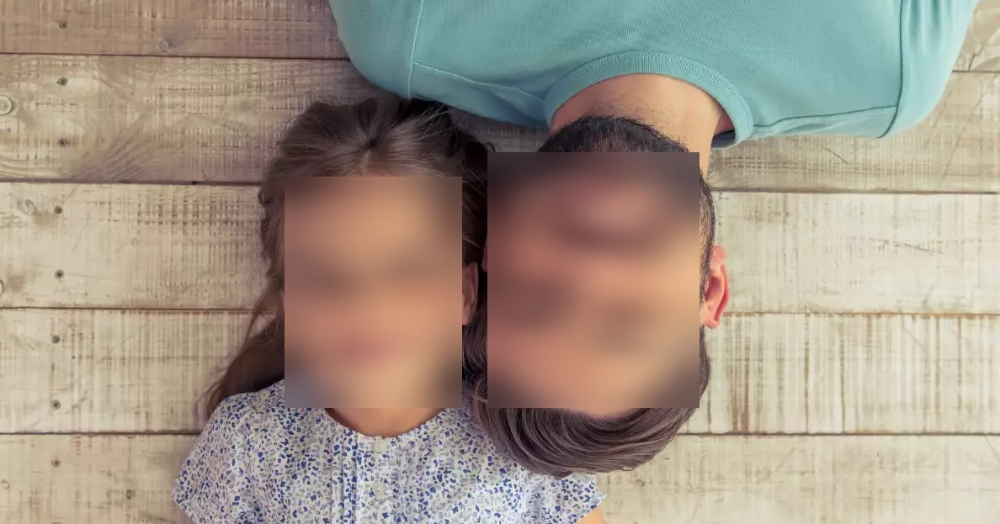

# [How to Blur Faces in Images using OpenCV in Python](https://www.thepythoncode.com/article/blur-faces-in-images-using-opencv-in-python)

To run this:

- `pip3 install -r requirements.txt`
- To blur faces of the image `father-and-daughter.jpg`:

    ```bash
    python blur_faces.py father-and-daughter.jpg
    ```

    This should show the blurred image and save it of the name `image_blurred.jpg` in your current directory.

- To blur faces using your live camera:

    ```bash
    python live-blur-faces.py
    ```

- To blur faces of a video:

    ```bash
    python video-blur-faces.py video.mp4
    ```

## Face Detection and Blurring Application

This code is a simple face detection and blurring application using OpenCV. It detects faces in real-time from the default camera feed and applies a Gaussian blur to them. Here are the steps involved:

1. Import the necessary libraries: cv2, numpy, and time.

2. Define the paths to the prototxt file and model file for the Caffe model.

3. Load the Caffe model using `cv2.dnn.readNetFromCaffe()`.

4. Connect to the default camera using `cv2.VideoCapture()`.

5. Enter a forever loop to continuously detect faces and apply blurring.

6. Read the live frames from the camera capture.

7. Get the width and height of the image.

8. Preprocess the image by resizing it to (300, 300) and subtracting the mean values.

9. Set the preprocessed image as the input to the neural network model.

10. Perform inference and get the output from the model.

11. Loop through the detected faces and check their accuracy level.

12. If the face accuracy is above 40%, blur the bounding box region.

13. Apply Gaussian blur to the detected face region.

14. Replace the original face region with the blurred face in the image.

15. Display the final image with blurred faces.

16. Break the loop if the user presses the 'q' key.

17. Calculate the frames per second (FPS) of the processing loop.

18. Close all OpenCV windows and release the camera capture.

Please note that this code assumes the presence of the necessary model files and weights in the specified paths.

## Output faces become blurred

  

## Path prototxt model Caffe

```python
# https://raw.githubusercontent.com/opencv/opencv/master/samples/dnn/face_detector/deploy.prototxt
prototxt_path = "weights/deploy.prototxt.txt"
```

## Path model Caffe

```python
# https://raw.githubusercontent.com/opencv/opencv_3rdparty/dnn_samples_face_detector_20180205_fp16/res10_300x300_ssd_iter_140000_fp16.caffemodel
model_path = "weights/res10_300x300_ssd_iter_140000_fp16.caffemodel"
```
